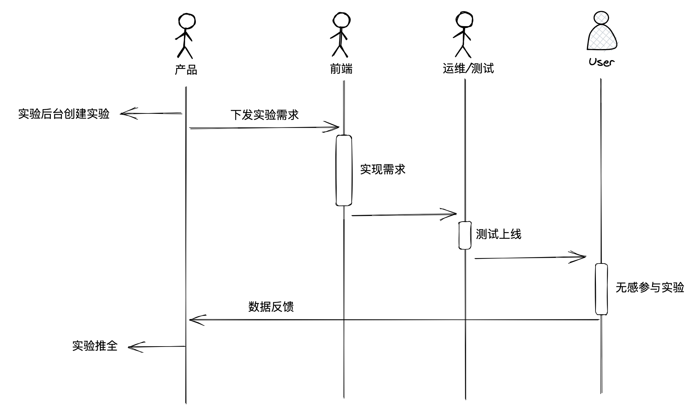
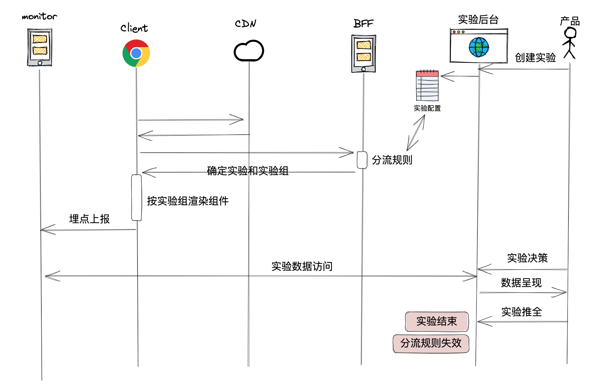
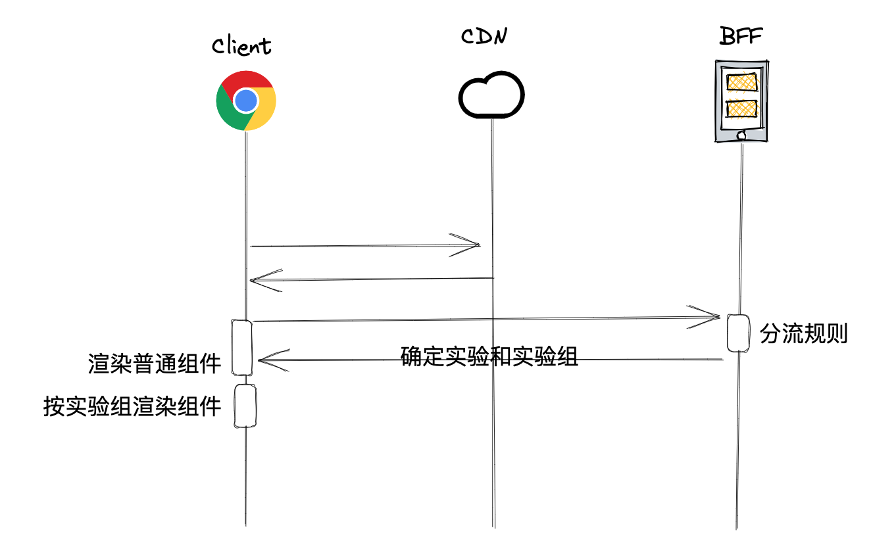

# ABT 在前端基建中的实践

## 背景

产品有时无法确定哪种设计方案更好，因此希望前端能够同时上线多个产品方案，根据某套规则将用户导流到不同的方案。


在用户体验理论研究中，这种做法称之为 A/B Testing（后续简称 ABT）。

一次 ABT 实验会生成至少两套方案（对照组/实验组），并且可以允许多个实验共存。

ABT 实验会涉及多个岗位的协调，包含：前端、后端、测试、运维、产品，其中起主要作用的是`产品、测试、前端`。

## 问题和方案

ABT 为前端带来诸多的挑战，其中包括：

### 如何协作？

在一个实验生命周期内涉及到哪些角色，角色之间是如何协作的？

- 创建实验：例如一块区域几种 ui 格式、一个组件在 2 个实验中的 ui 交互改动不一样。主要作用：通过不同的用户反馈，对照几组数据，选出最好的

- 上线后：用户就会被分别到不同的组别，参与实验，直到实验结束
- 数据反馈：前端监控-数据埋点
- 数据呈现的数据来自于：前端监控-》数据埋点-》得到监控埋点的数据



### 前端如何开发？

实验具有以下几个特点：

1. 多个实验共存
   产品可能会先后发起几十个甚至上百个实验，不同的实验有不同的分流规则，每个实验又有多个对照组
2. 实验是精确到组件的，一个实验对应到多个前端组件
   一个组件不同的对照组之间的差异是灵活的
3. 实验是频繁的
4. 用户参与实验必须是无感的
5. 实验推全后只保留一个对照组

#### 流程和结构

ABT 运作流程



ABT SDK 的结构


整个 ABT-SDK 包含了诸多 API 和工具，为应用开发提供支撑，其中

- ABTCore： 提供 ABT 最底层的核心功能，比如实验信息、分流控制、代码剪枝、数据决策等等
- ABT-Server： 针对服务器提供一些中间件
- ABT-Vue/ABT-React： 针对前端两种框架提供一些组件、仓库、路由等
- ABT-Webpack/ABT-Vite： 针对前端两种常见构建工具，提供一些插件集成，比如 ESLint 工具、PostCSS 插件、命令行工具等等

#### 如何分流？

1. 使用 Redis 存储当前每个实验不同对照组的参与人数(`例如：按照比例分`)
2. 使用浏览器指纹+用户身份保证同一用户对同一实验仅参与一个组
   两种做法
   - 将指纹+用户身份+组打包成 JWT 发送给客户端（不精准，成本低）
   - 使用数据库保存映射关系（精准，成本高）
3. 按照规则中的分流比例为新用户分配组别
4. 将所有实验的 ID，以及每个组别的编号下发到客户端

#### 如何改变运行代码？

实验和组别对运行时的影响主要是渲染组件的不同，但也有可能对其他代码造成影响。

由于每次实验所产生的差异是极其灵活的，因此难以使用一种标准化的静态格式来描述差异，这就不可避免的造成了对业务代码的侵入。

基建的一个重要目标就是要将这种侵入最小化、标准化。

**提供高阶组件屏蔽组件差异**

vue 示例

```vue
<ABTesting name="exp1">
	<template #default>
		<DefaultComp></DefaultComp>
  </template>
  <template #groupB>
  	<GroupBComp></GroupBComp>
  </template>
  <template #groupC> 
  	<GroupCComp></GroupCComp>
  </template>
</ABTesting>
```

react 示例

```react
<ABTesting
  name="exp1"
  groupB={<GroupBComp></GroupBComp>}
  groupC={<GroupCComp></GroupCComp>}
  >
	<DefaultComp></DefaultComp>
</ABTesting>
```

**提供高阶函数屏蔽 API 差异**

```js
export const utilMethod = ABTCore.choose(
  "exp1",
  defaultMethod,
  groupBMethod,
  groupCMethod
);

const result = ABTCore.call("exp1", defaultMethod, groupBMethod, groupCMethod);
```

**使用自定义指令屏蔽 CSS 差异**

```css
/* style.css */
@ab-testing exp1 {
  default {
    /* default styles */
    .a {
    }
  }
  groupB {
    /* groupB styles */
    .a {
    }
  }
}
```

利用自定义的 PostCSS 插件，会将上面的代码转换为

```css
exp1-default-a {
}
exp1-groupb-a {
}
```

与此同时，我们也改变了 CSS Modules。

默认情况下，开启 CSS Modules 后，上面的代码会被转换为下面的 JS

```js
export default {
  "exp1-default-a": "hash1",
  "exp1-groupB-a": "hash2",
};
```

我们对此作了改变，将代码变成了：

```js
import { chooseValue } from "ABTCore";
export default (function () {
  return chooseValue("exp1", {
    default: {
      a: "hash1",
    },
    groupB: {
      a: "hash2",
    },
  });
})();
```

#### 实验推全后如何处理？

当产品完成实验后，会选定一种方案进行推全。

此时，会涉及到对应实验的代码如何剪枝的问题？

由于实验 SDK 并不向外界暴露当前用户所处的实验分组，因此，业务开发者要根据不同分组进行不同处理的代码逻辑必须使用实验 SDK 才能完成。

这就对自动化的实验推全提供了基础，由于所有的实验代码都是使用 SDK 完成的，因此可以通过一个简洁的逻辑即可完成自动化实验推全：

1. 实验 SDK 为各种构建工具提供插件
2. 打包时，插件会通过代码分析（AST），找出当前哪些文件对应到哪些实验
3. 插件会对照最新的实验信息，找到已经被推全的实验
4. 插件定位到所有与该实验有关的源码文件
5. 插件提示开发者，是否对已推全的实验进行剪枝
6. 开发者确认后，插件自动修改 AST 完成剪枝

通过 AST 完成剪枝逻辑是非常容易的

比如针对组件的剪枝

剪枝前

```vue
<ABTesting name="exp1">
	<template #default>
		<DefaultComp></DefaultComp>
  </template>
  <template #groupB>
  	<GroupBComp></GroupBComp>
  </template>
  <template #groupC> 
  	<GroupCComp></GroupCComp>
  </template>
</ABTesting>
```

剪枝后（假设将 groupB 推全）

```vue
<GroupBComp></GroupBComp>
```

#### 细节问题？

**白屏问题**

对于一个 CSR 应用，它的组件渲染取决于所处的组别，而它所属哪个组别又必须通过网络通信才能确定。

这就导致了首屏渲染的白屏问题。


而我们观察到整个应用中实际上只有部分组件会参与到实验，对于没有参与到实验的组件是不需要等待分组信息的。

因此，我们将参与到实验的组件制作为异步组件，从而可以不影响其他组件的渲染。



**代码检查问题**

由于实验推全时需要对代码进行剪枝，剪枝发生在编译时态，它通过 AST 检查代码中包含的 ABT-SDK 代码完成，而大部分 ABT-SDK 中的 API 都需要绑定实验名称，例如：

```js
ABTCore.call("exp1", defaultMethod, groupBMethod, groupCMethod);
```

如果实验名称来自于一个变量或表达式或者其他需要在运行时才能确定的值，这就会导致剪枝失败。

因此我们制作了 ESLint 插件来约束开发者必须使用字面量或者其他在编译时态能确定的值。

**开发规范**

ABT-SDK 不会暴露用户的分组信息给开发者，这主要是考虑到开发者可能写出下面的代码：

```js
if (用户的分组 === "B") {
  // 代码1
} else if (用户的分组 === "C") {
  // 代码2
}
```

这样的代码无法被代码剪枝工具察觉，容易在实验推全后仍然保留在代码中，虽然功能性不受影响，但会逐步降低代码的可维护性。

以上是不暴露的主要原因。

但开发者仍然有可能间接的获取到用户的分组，比如：

```js
const data = ABTCore.data("exp1", {
  groupB: "B",
  groupC: "C",
});
if (data === "B") {
  // 代码1
} else if (data === "C") {
  // 代码2
}
```

这种代码很难通过自动化工具检查处理，因此需要通过开发规范来约束：

_所有跟实验相关的处理，必须通过 ABT-SDK 完成_

## 简历和面试

### 简历

**项目名**： XXX 项目前端 ABT-SDK 基建

**岗位**： 高级前端工程师 / 前端架构师

**项目介绍**：

1. ABT-SDK 是一套为 AB 实验提供技术支撑的开发工具包，它分为底层的 ABT-Core，以及上层的 ABT-Server、ABT-Vue、ABT-React、ABT-Webpack、ABT-Vite，可以集成到 BFF、Vue/React 框架、Webpack/Vite 工程。
2. 整个 ABT-SDK 的开发使用到了诸多前端技术，包括但不仅限于： 自定义 PostCSS/ESLint/Webpack/Vite 插件、AST 分析、浏览器指纹、Vue/React 高阶组件、脚手架开发...

**项目职责**：

1. 参与 ABT 工具链的开发和集成
2. 参与 ABT 规范和协作流程的制定
3. 参与 ABT 和前端框架的集成
4. 其他技术难点攻坚

**项目亮点**：

从 0 到 1 开发整个 A/B Testing SDK，为产品制定 AB 实验提供技术支撑，SDK 可作用于 Vue、React、Webpack、Vite、BFF 等前端常见的技术场景，为 AB 实验开发提供全流程支撑。

整套 SDK 不仅中止了 AB 实验业务开发的混乱局面，为前端 AB 实验业务的开发提效 70%，减少 90%的代码出错几率，同时大幅提升代码质量。

### 面试

**请介绍你开发的 A/B Testing SDK**

> 先讲背景

这套 SDK 是为支撑 AB 实验研发的，属于是我们前端基建的一部分。

<!--AB实验是用户体验研究的一套方法论-->。

<!--在设计产品时，产品设计师有时可能希望同时上架种设计方案，然后观察每种方案得到的数据反馈，业内把这种做法就叫做AB实验，意思是通过AB两个组别来获取数据支撑，在实际的场景中，可能会有更多的组别。-->

之所以要开发这套 SDK，是因为在没有它之前，要走完一次 AB 实验的流程成本是非常高的，**后来经过我的调研和分析**，造成这种高成本的根本原因就是缺乏标准化。

具体来说体现在几个方面：

1. 没有标准化的流程 --> 管理成本
   举例： 实验冲突问题
2. 没有标准化的工具 --> 维护成本
   举例： 实验推全时代码剪枝问题
3. 没有标准化的 API --> 开发成本
   举例： AB 实验全面侵入业务代码，心智负担过重

> 方案选择

所以，解决方案是非常明确的，就是标准化。

但如何标准化，目前前端领域没有一个统一且成熟的答案，之所以没有，是因为 AB 实验是深度绑定业务的，而业务的差异化导致难以在技术领域形成标准。

可以把每次实验的每个组别都当作是产品提出的一次业务需求，这种需求是极其灵活的，因此难以形成技术领域的标准。

虽然难以形成技术领域的标准，但形成公司内部的标准却是可行的。

当然这种标准是多方面的，我这里单从技术的角度聊一聊 API 的标准化。

API 标准化的重要目标就是要把前端代码当中所有跟 AB 实验相关的代码从语义的角度进行隔离。

举例 1： 逻辑判断

举例 2： 高阶组件

这种隔离不仅可以提升开发效率，而且对将来的实验推全奠定了自动化的基础。

当然，API 只是整套 SDK 的一部分，因为我们的前端代码是散落在不同技术位置的，比如 node 服务器搭建的 BFF、以 jQuery 为主的活动页面、Webpack 搭建的多页应用、Vite 搭建的组件库等等等等。

要适配多种技术场景，我们把 SDK 分为了底层和上层，底层提供核心 API，上层调用底层的 API 产生多个库，适配不同的技术场景。（见简历）

总之，整套 SDK 就是保证无论是哪种技术场景，都能够在其中找到合适的工具。

比如自动化的实验推全，SDK 中有相应的命令行工具，也可以使用它的 webpack 插件或者 vite 插件在打包时自动推全。

比如实验分流，SDK 中有相应的工具，会根据用户身份和浏览器指纹以及分流规则、实验状态等信息共同决定用户应该处于哪个实验分组。

再比如对于 CSS 代码，SDK 中有相应的 PostCSS 插件，可以识别我们自定义的 CSS 指令，这些指令是我们单独为 AB 实验定制的，因此需要开发自定义的插件来解析。

> 最终效果

总之，有了这套 SDK 后，我们有过统计，在 AB 实验的开发效率上提升了 70%，并且减少了 90%的代码出错几率，同时在代码可读性可维护性上都有大幅度提升。
