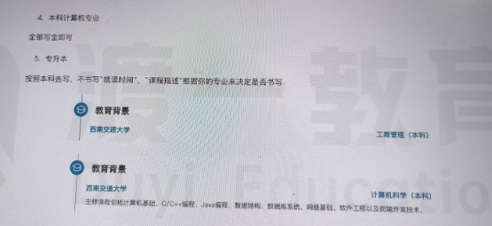

# 就业的核心问题

1. 利用**有限的时间**，**最大的限度**的题设各个环节的 <span style="background-color: yellow;">表现</span>，从而**提升**简历和面试的**通过率**。

2. 流程：
   

3. 准备

- 面试表现力训练
- 简历制作
- 项目准备
- 非技术问题

# 面试表现力

## 什么使面试表现力

&emsp;&emsp;在面试环节中，求职者不断的面试官传递信息,这些信息的总和决定了面试官对求职者的整体印象。信息由多部分组成,包括: **_内容、音量、语气、语调、表情、肢体语言、表达节奏、外在形象.._**除内容本身之外,所有的一切统称为面试表现力

## 作用

&emsp;&emsp;最好的情况就是稳定在一个区间段上


## 如何提升表现力?

- 每个人有不同的区间，每个人能够达到的表现力不是一个点，**_而是一个区间_**。
- 所有尝试跳跃区间的行为都会引起对方厌恶。
- 所以，不要试图将自己伪装成另外一个人。
  因此,提升表现力的关键,是**_找到自己表现力最好的状态_**,并将它强化,贯穿到整个面试过程中。

## 准备例子

1. 理解:**_理解_**下面的这段内容,**_达到熟悉的程度_**
   
2. 复述:能够脱离文档，说出上述内容
   注意:

- 复述必须要出声
- 复述不是背诵；复述时不能回忆文档内容,而是**_根据自己的理解说出来_**。
- 复述时不要求流畅,可以停额,可以思考。不用考虑自己复述的好不好,语气、声调这些都不用考虑，只要复述达标即可。
  &emsp;&emsp;如何判断复述这一步是否达标:只要能够全程不看文档,把内容完整的说完、没有遗漏即可。复述必须连续三次达标才能进行到下一步,否则就重复 1、2 两个步骤,直到达标为止,才能进行到下一步。

3. 回忆:回忆过去,特别是近期,所有跟其他人长时间交流的场景,找出自己表现最好的一次。

- 如何判断最好:最放松、最自信、最舒适、最从容

4. 代入:代入上一个步骤找到的感觉,用当时的感觉重新复述。

## 常见问题

1. 我自己表现力很差,找不到过去表现好的场景怎么办?
   &emsp;&emsp;这种情况通常不会出现,所谓的表现力差是你自己否定自己的结果。
   往往找到相对最好的，其实就是最好的。如果情况特殊，实在找不到,那就只能靠想象了。
   想象个场景,想象一个真实的对象,找到自己最放松、最自信、最舒适、最从容。
   切不可把自己想象成另外一种人，只能是当下的自己。
2. 我在复述时老是会卡壳,没办法流畅的表达怎么办?
   &emsp;&emsp;复述时不要求流畅,可以停顿,可以思考,这些都是自然的表达。
   相反，过于流畅和完美反而会显得不自然。实际上,如果对内容熟悉到一定程度,反而应该放缓表达节奏,避免“过度完美"造成的不自然。
3. 私底下复述很好,面试环节就不行了
   &emsp;&emsp;紧张、压力都会影响到表达。记住放松的感觉,同时将注意力集中在要表达的内容上,反复适应,逐渐就能找到自然表达的感觉。尝试刻意的放松肩膀、面部,非常有用。
4. 复述的时候需要配合肢体语言吗?
   &emsp;&emsp;肢体语言是自然发生的事,无须刻意配合,也不能刻意配合。

# 写简历

## 基本认识

&emsp;&emsp;简历的好坏会影响简历通过率；简历的嚣张程度会影响面试的通过率。一般来说:
简历越嚣张,简历通过率越高，面试难度越高。简历越保守,简历通过率越低,面试难度越低。
&emsp;&emsp;需要找到一个平衡，从而达到综合通过率最高:如何找到平衡?

- hr 满意的工作经历：
  

- `保证简历通过率的同时，要能够让面试表现和简历基本匹配。`

## 制作准备

&emsp;&emsp;自己先准备一份简历，然后按照后面的修改。


- 工作经历的问题：不能删除最后一份工作，因为可能要离职证明
- 工作时长不够：不能动最后一份工作。有多份工作，最后一份工作不够，拉长前几份工作经历。只有一份工作，就造几份工作。没有工作经历，得造工作经历。
- 造工作经历怎么选择公司：去国家企业信用信息公示系统，找近期注销的公司（`像计算机的`）。注意注册时间与注销时间。
- 优化工作经历(一般最后一份工作)\工作年限的时候：
  不能主动说

## 简历准备

1. PDF 简历（个人简历）：面试要用的。
   &emsp;&emsp;全民简历、五百丁、锤子简历等

- 简历模板选择:统一选择第二排中间的模板**_（标准排版的）_**
- 面色:统一选择偏蓝的领色，蓝色能够代表科技感以及专业性
  

2. 平台简历：BOSS 直聘、智联招聘、拉钩等; 基本与个人的简历一样。
3. 前端工程师简历模块

- 基本信息：个人信息、求职意向
- 技术栈
- 教育经历
- 个人优势/个人评价
- 工作经历
- 项目经历

## 个人信息

- 必写：年龄、性别、籍贯、工作年限、电话、邮箱、qq\微信号
- 可选：头像照片、个人博客、开源地址、婚姻状况、政治面貌（除非招聘有要求）

1. 工作年限：如果有真实工作经历，填写真实工作经历的年限；如果没有真实工作经历，或者真实工作经历小于三年，统一选择三年。
2. 电话号码:采用 3 4 4 格式
3. 添加个人博客模块：可以是个人，也可以是平台，平台最好是掘金、语雀、思否

- 如果没有，你就不添加；如果不能起到正向作用，也不添加
  

4. 添加开源贡献：书写 github 或者 gitee 主页

- 如果没有，你就不添加；如果不能起到正向作用，也不添加
- 如果你的开源贡献比较多:有个人网站、
  第三方博客、github 地址、gitee 地址.这种情况单开一个板块，这个板块就叫做开源贡献
  

  婚姻状况：不用写
  政治面貌：不用写（除非招聘有要求）
  头像照片：可要可不要

## 求职意向

&emsp;&emsp;一般放在与个人信息一起

- 意向岗位：前端开发工程师
- 意向城市：意向城市根据实际情况来填，如果没有确定就不填。
- 意向薪资：个人简历一般不写，平台简历要写。

```
影响因素
1. 工作年限
2. 所在册灰姑娘是
3. 职友集上面查一下所在城市的一个薪资范围
```

- 入职时间：随时到岗

## 技术栈

1. 个人简历模块位置：基本信息 -> 开源贡献 -> 技术栈
2. 平台简历内容也一样
3. 描述不能太多
4. 模板（根据模板的术语编写、组合）

- 中低端岗位
  
- 高端岗位
  
  

## 教育经历

1. 个人简历模块位置：基本信息 -> 开源贡献 -> 教育经历
2. 两种：一种单开个模块，第二种直接在个人信息中写：本科
   
   
   
   

## 个人优势/个人评价

1. 个人简历模块位置：基本信息 -> 开源贡献 -> 技术栈 ->个人优势/个人评价
2. 可以不要这个模块
   
   

# 面试常见问题

&emsp;&emsp;**_表诉自然 + 理解的内容_**

## 打招呼

&emsp;&emsp;**_开场+匹配岗位的充分理由+要回复+祝福。_**

- 匹配岗位的充分理由：按照招聘要求写，但是费时间，看自己。也可以统一写（岗位多的话）

```
中低端岗位:
您好，小姐姐(x先生)。
我对贵公司正在招聘的XXX岗位很感兴趣,我有过X年的前端开发经验,曾参与过多次技术攻坚,贵公司岗位描述中涉及到的技术
和要求我都能满足,能力方面肯定不会让您失望。
非常期待和贵公司做进一步的沟通了解,期待您的回复,祝您工作愉快~

高级岗位:
您好，小姐姐(x先生)。
留意到贵公司正在招聘的XXX岗位,这方面我有X年的前端架构经验,曾任XX公司的XX岗,
参与过多类目的基础设施建设,因此能力面无须担心，完全能覆盖贵公司的招聘需求。
最近恰值空窗期，也在思考下一步的职业走向。
对于贵公司的工作我曾有一定的了解,非常期待能够有进一步接触的空间。期待您的回复，祝您工作愉快~
```

## 已读不回

&emsp;&emsp; **_隔两三天再发,开场+缩小时间窗口+要回复+祝福_**

- 有些公司只是挂着，很正常。

```
很抱歉再次打扰您目前我这边有了offer,
但我还是对贵公司更感兴趣一些,所以还是想来确认一下是否还有面试机会。
理解您有您的难处,如果实在不行,也请告知一下问题在哪,来日方长,将来说不定还有成为同事的机会,万分感谢。
祝工作顺利~
```

## 自我介绍

**_基本原则:_**

1. 让面试官认识到自己的能力
2. 让面试官认知到自己的意愿
3. 让面试官感到亲切
4. 引导面试官的后续问题

```
中低端岗:开场+意愿+能力+夸赞+问题
面试官您好，我叫XXX,目前在前端这个领域有x年经验。
之前有过X份工作经历，不过我这一次我希望找到一个业务能够一直深耕下去,和公司一同成长。
所以这一次投递简历我是认真看了公司的招聘要求和业务范围后才投递的。
因为咱们公司是专业做低码平台的，这恰好也是我一直想做的事。
之前的工作当中没有机会接触到这部分业务,更多的是一些传统的业务开发,除了最近两个项目有些比较复杂问题需要处理,其他的项目大ī多数时候其实像是一个体力活。
因此我在工作之余,都是尽量的抽出时间自己去积累一些东西,特别是关于浏览器和前端框架的一些底层原理上,我还是花费了很多的精力去专研的。
有这些基础能力在,我相信这个业务我虽然没有接触过,我也能够在短时间内迅速的上手。
当然，如果我能加入进来，以后肯定要多跟你讨教，,还要向您多学习。
嗯，我的大体情况就是这样了，看面试官还想了解哪些?


高级岗:开场+意愿+能力+夸赞+问题：
面试官您好,我叫XXX,目前在前端这个领域有x年经验,其中包含x年的业务开发经验,x年的架构经验。我在上一家公司担任的是前端专冢,主要负责前端标准化、代码质量管控、基础设施建设等技术任务,有事也会帮着团队处理一些业务难点。
曾帮助公司β建了一套端到端测试系统,日均执行8000多次,服务于9个BU,46条业务线,200多前端和测试人员,接入项目200多，用例数1300多，目前已经纳入公司的公共服务。
目前呢，我也是在思考我将来的职业发展问题,希望能够找到一家企业共同成长。
我发现呢咱们公司目前正在开展xx业务,这是我非常感兴趣的,相信我的能力肯定能帮上忙,能为公司带来高价值,所以就给公司投递了简历，承蒙不弃，有了这次面试机会。
当然了,每个公司的情况不一样,如果我能加入进来,业务上和技术上以后肯定还要跟您多讨教,还要向您多学习。
嗯，我的大车箢蕴概情况就是这样了，看面试官还想了解哪些?
```

## 为什么离职

&emsp;&emsp; **_不是能力问题,不是态度问题；一定不能让面试官感受到压力和不安:_**

1. 对上家公司不能有戾气,不要倒苦水,不能埋怨、!
2. 不能出现不负责的行为
3. 对上家公司要表现出理解
4. 上家公司的问题是这家公司不可能有的(包括将来)
   建议从几个方面回答:
5. 不可抗力:业务线被砍、公司注销、公司搬离异地、...
6. 价值观:同事关系复杂、官僚气息重、歪风邪气、.

```
表达结构:肯定+否定+理解+期望
那家公司吧其实其他都挺好,领导对我也很好,同事关系也很好,就是对个人发展来说太受限了。
因为公司里面很多人都是在混日子,很多问题都是能拖则拖,就算解决也是应付了事,其实好多问题bug都是没解决干净的,好多时候都是我去提出来,然后我去负责处理，我都快成公司的劳模了。
所以我就担心啊，一直在那里待下去会不会有一天自己也变成了那样的人。
所以思虑再三,还是出来了。当时我把最后一次版本迭代完成后,就把工作交接了。
其实后续还陆陆续续的有一些BUG其他同事解决不了,为这个后来我还专门跑去公司了几趟,又帮他们写了一些规范文档,梳理了一下整个技术结构,现在都没啥问题了。
就是这个问题,其他都挺好,之前的同事都还有联系,有时候给他们推荐一些技术文章,也有约出来吃个饭啥的,就是这个散漫的工作氛围我实在不能久待，其实就是这个问题。
```

## 是否接受加班

&emsp;&emsp;**_打太极：先肯定,再给期望,再理解_**

```
加班很正常，没问题。
但是呢,我还是希望加班能有加班工资,这也是对我劳动的肯定,同时呢,也希望没有那种无意义的加班,有些公司呢,是为了加班而加班,其实大家都在加班摸鱼,这样的加班其实无论是对员工还是对公司我认为都不太好。
当然,每个公司有自己的难处,确实有困难,需要大伙努把力、加把劲,我也能理解,反正有事一起担,有压力一起扛,没啥问题。

也希望没有那种一到放假日就打着放假的口号冲业绩。手头项目时间已经很紧张了，下班还要要求加班弄其它项目。
```

## 期望薪资

&emsp;&emsp;一般是面试尾声。

- 涨薪比例：按照地域算。重庆 7k，北京不可能算 7k 吧

```
弱势谈薪资：
我更看重发展,薪资只要不低于行业标准，我都能接受。

强势谈薪资：
是这样,我谈一下我的情况,xxx公司和xxx公司我也面了,其中一家能给我xxx(你期待的150%),另一家还在看我意向讲实话,我还是非常想来咱们公司的,这的氛围和文化,以及技术前景和团队素养,我都非常喜欢,如果咱们能给我下offer的话不低于xxx(你期待的110%~120%)我就可以接受
```

## 缺点是什么/优点是什么

&emsp;&emsp;**_谈优点，要聊到缺点,谈缺陷要聊到优点。_**

```
一个追求完美的人,做事会做到极致，同时也容易患得患失。
一个急性子,行动力很强,同时也容易冲动。
一个慢性子,往往成熟稳重,同时也容易错失良机。
胆大的人,往往敢于尝试,也容易铤而走险。
胆小的人,往往稳如磐石,也容易古板顽固。
```

&emsp;&emsp;**_对自我要有认识，对问题有办法。_**

```
示例:
我是一个急性子,这是我最大的问题。
虽然这种性格给我带来了一些优势,比如行动力很强,问题不过夜, 做事效率高,但在另一方面,也因为很多事情着急下手导致各种失误。
这些年我其实一直在通过一些方法来改善这一点,比方说我用过的方法中,非常有效的PDCA循环工作法,把工作任务拆解为Plan(计划)、Do(执行)、Check(检查)和 Act(处理)四个阶段的循环,通过这种任务细分,可以很好的避免着急完成任务导致的各种问题:
要说性格,我估计很难改的掉,但至少现在,至少在工作层面,不会因为我的急性子造成什么问题。
```

## 问职业规划：

两个方面讲：

1. 主线 技术线
   业务开发-->架构基建（一般前端人数>=30 个人）---> 前端 leader ---> 全栈---->系统架构师/高级运维岗
2. 支线 非技术线（管理岗、创业、副业等）：最好要有一个更高的层次人带，才能走

```
没有从事过架构岗:
我的目标是首先能够成为前端架构师。技术方面我一直以来也在不断积累,比方说之前自学的XXX、XXX其实都是在为这个目标去做沉淀。另外经验和实践方面,那以后只能仰仗面试官您了，以后您有空的时候,还希望不吝赐教。当然,鐒肯定得从一个大头兵开始干,跟着公司一起成长发展。咱们边干边沉淀,随着自己的积累,随着咱们公司的业务不断发展，我相信将来有机会让我尝试更有挑战的工作。我要干得好,可以让我试试,要干得不好,我继续埋头苦练就是了,都能理解。

已从事过架构岗:
之前我从事过前端架构,所以希望将来有机会继续从事这方面的事情,因为我在这方面毕竟有不少经验,也能用自己的技术能力帮助公司节省成本，提升效率。
当然，这一切取决于公司的整体安排。
另外呢,我也在自学一些其他技术,像运维、后端等也在学习,反正我也比较感兴趣,所以先积累着,将来如果公司有需要,我可以有更多发挥价值的地方。
总之呢,随着公司的业务发展咱们一起成长,我相信只要企业发展好了,机会自然多的是。
```

## 同事关系

&emsp;&emsp;**_一定要从企业的角度去考虑问题_**

1. 问:如果同事让你帮忙写代码，你怎么办?
   &emsp;&emsp;答:毫无疑问的,首**_先看公司的规定和文化_**,如果是公司明令禁止或不提倡的,当然是友好的拒绝。如果没有,则要根据情况而定,比如同事是否真的有其他事务无法完成这些代码,比如自己是否还有工作没有完成,综合这些情况再来决定是否帮忙。当然,就算要帮忙,**_也需要让领导知道_**,以便对人员的工作做出更好的调整积客挑
2. 如果你的看法和同事不一致怎么办?

- 有些事情是有对错之分的,比如代码的正确运行和报错,就是对错之分。
- 有对错之分的分歧很好解决,做个测试即可分清楚,这方面如果是对的,要据理力争。
  有些事情是没有对错之分的,比如选择什么样的架构,使用什么样的算法,这种情况下出现分歧,那么各自只需要讲出自己的道理进行讨论即可,如果实在无法达成共识,那就交给领导来定夺,如果是不需要牵扯到领导的事情,那也需要找到一种办法,让这件事在一个可控范围内。

## 问考官的问题

最后一个问题：不能是具体场景怎么做？要问一个宏观的问题

1. 不能问自卑且愚蠢的问题:**_（除非就一面，没有 hr 面，可以问一嘴是否后面有二面）_**

- 多少薪资、组成结构；有哪些福利待遇
- 要不要加班等
  &emsp;&emsp;可以体现职业素养，可以做人情世故

2. 如果我入职了,我会参与到哪一块业务,具体工作职责是什么。适当的给回应:

```
"哦哦,那挺好啊,这块业务也是我特别喜欢做的"
"看得出来咱们是一个非常专业的团队,非常期待能够加入"
"这方面的业务我过去有一定的经验，相信肯定帮得上忙"
```

2. **_将来_**如果我在公司干得好的话,是否存在往上晋升的 **_可能性_**?

```
适当的给回应:"那挺好啊,这完全符合我的职业发展规划.
如果有机会,我希望能够一直跟着公司/您发展”“看得出来,咱们公司/您真是为员工考虑了很多,说实话,这样的公司/领导现在真不多”
```

3. 最后一个问题,提前准备一个主观问题(必须要自己会点),别太难,以防他回答不上;也别太简单,回答的容易不精彩;更别和自己的优势相冲突,降低自己的水平。
   设计的有价值一点,待他回答完，去称赞他。"搞这么多年技术,这是我见过最精彩的一次讲解.",“卡主我好久的点,您一下就给我说通了,以后要能跟您发展,一定得好好跟您学本事”
   "我就想问一个问题,如果我入职到公司,我能分到您的组吗,我想跟您混."--- 提前表态,认大哥,语气诚恳一点

```
1. Vue和R闹eact的技术选型
2. 模块拆分的颗粒度该怎么把握
3. 对代码质量的评判您的标准是怎样的
4. 您站得高看得远/您是行业前辈,经验丰富,想请您指点一下,我接下来应该往哪个方向去学习积累,以及对我日后学习有什
么建议。
5. 您站得高看得远/您是行业前辈,经验丰富,想请您指点一下,前端做到头后有没有更高的发展方向呢?
```

4. 要微信：
   &emsp;&emsp;能不能加个微信，不管这个面试能不能入职，我希望呢我们以后可以成为朋友，可以多讨论技术，一起学习。

```
哪怕如果发挥失利，也要尽可能加上对方的微信公司今天招人，明天就可能还招人
你加的可是考官
私下里搞好关系,处得好,下次招聘他还会给你机会,甚至原题面你这种原地就能争取的机会，千万不要错过
```

## 学历问题

- 有学历要求的情况下，最理想的情况:平台沟通不涉及到这个问题,面试过程表现优秀,面试氛围轻松愉快,面试结束一带而过,入职轻描淡写。

1. 平台沟通环节
   &emsp;&emsp;学历不好（除非 985、211）,`这个环节一定不能主动说,被动问到的时候,给话术。`
   
2. 面试环节
   &emsp;&emsp 这个环节中,必须满足下面的条件才可以主动说: 1.上一个环节没说过 2.整个面试过程氛围很好
   `即便是要主动说，说的时机一定是在面试完成后。`

```
对了,面试官/张哥,还有个事儿我跟您汇报一下,就是我的学历不是全日制的本科,但请放心,我的工作能力肯定没问题。就是不知道咱们公司对这一块是不是有规定,如果有规定的话您看到时候能不能通融通融,因为这一块我想改变我也确实改变不了。
```

3. 入职环节

- 这个环节,必须是前面的环节中没说过才可以主动说:入职之前一定要维护好跟 HR 的关系,
- 一定要尽快的主动说：

```
对了小姐姐有个事我一直想跟你说,这两天忙没顾上。
就是我的学历不是全日制的本科,升本的证书一时半会儿还下不来。
我以前的公司不在意这个所以我一直也没怎么关注,最近我朋友跟我说现在很多企业都要过问一下学历,所以我跟你汇报一下这个情况,别到时候影响你的绩效什么的。
不过我的工作能力绝对没问题,肯定不会让你失望,而且我一直都特别希望能够加入XX,能够跟您和面试官成为同事,我觉得你们对我都挺好。
所以,如果咱们公司如果卡的不是特别严格的话,还希望您能够帮忙通融通融,永远感激，如果影响你业绩了那我必须双倍补上。
```

## 问到公司业务

&emsp;&emsp;包装年限、优化工作经历的时候,可以下面回答：

1. 外包公司,交付不赚钱、靠维护赚钱
2. 注重代码质量
3. 注重公共代码沉淀
4. 前端是一位字节专家带队

## 离职证明/背景调查

&emsp;&emsp;包装年限、优化工作经历的时候,可以下面回答：

1. 公司已己注销,当时离职没有考虑到这个问题
2. 有以前领导的联系方式(留自己的、朋友的)

# 投递简历与面试准备：

## 简历投递

1. 沟通时间：最好是工作日上班的时间沟通（早上上班时间）
2. 直接投递：当天晚上，或者沟通的时候
3. 投递数量：日均投递数不低于 30 次
4. 投递平台：\*BOSS 直聘、智联招聘、前程无忧等
5. 投递之前:

```
投递前多渠道了解，简单了解即可
1.招聘要求
2.公司官网
3.看准网(https://www.kanzhun.com/)
```

6. 公司官网、看准网（不是每个公司的都能查到）：要面试的时候也要简单的了解
7. `投递后：表格记录,记录面试邀约、岗位给的薪资、各种情况，说不定后面就忘了`

## 面试准备

1. 面试邀约：留出充足的准备时间--2 天以上
2. 面试准备

```
1. 多渠道了解公司:官网、招聘要求、看准网。
2. 发掘公司特点:业务、工作氛围、企业文化!
3. 寻找归属感。
4. 针对性的技术准备。
5. 个人形象、个人卫生
```

3. 面试前的心态调整
   &emsp;&emsp;战略上的藐视，战术上的重视不要把企业想象成敌人,不要站到对立面,面试是交流,是相互了解,不是打擂台
4. 面试复盘总结：

- 能录音尽量录音。
- 哪些地方做得好
- 哪些地方做的不好
